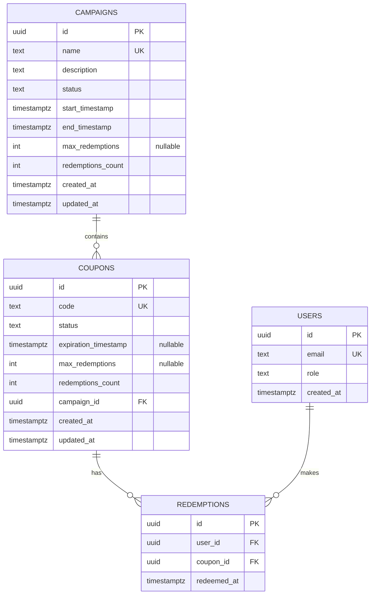

# Relational Schema

This document is a reviewer-friendly view of the data model. The database remains the source of truth through SQL migrations.

## Entity Relationship Diagram

## Cardinalities

- One campaign can contain many coupons.
- One coupon belongs to exactly one campaign.
- One user can make many redemptions.
- One coupon can have many redemptions, up to its configured limit.
- A redemption belongs to exactly one user and one coupon.

## Integrity Rules

- `campaigns.name` is unique and is used to detect an already existing campaign.
- `coupons.code` is unique and identifies the coupon in the redeem endpoint.
- `users.email` is unique, as required by the domain model.
- `redemptions(user_id, coupon_id)` is unique to prevent double redemption by the same user for the same coupon.
- `coupons.campaign_id` references `campaigns(id)`.
- `redemptions.user_id` references `users(id)`.
- `redemptions.coupon_id` references `coupons(id)`.
- Foreign keys use `ON UPDATE CASCADE` and `ON DELETE RESTRICT` so identifier updates propagate while existing relational history cannot be deleted accidentally.
- `status` is constrained to `available` or `not-available` for campaigns and coupons.
- `role` is constrained to `user` or `admin`.
- `campaigns.name`, `coupons.code`, and `users.email` cannot be blank.
- `campaigns.end_timestamp` must be greater than or equal to `campaigns.start_timestamp`.
- `redemptions_count` cannot be negative.
- `max_redemptions` is nullable. `NULL` means unlimited.
- If `max_redemptions` is not null, counters cannot exceed the configured limit.

## SQL Migration Details

- Primary keys default to `gen_random_uuid()` through PostgreSQL `pgcrypto`.
- Listing-oriented indexes support the admin coupon listing filters.
- Foreign-key indexes support joins and redemption lookups.
- `updated_at` is maintained through triggers on `campaigns` and `coupons`.

## Concurrency-Relevant Constraints

The schema supports the redemption transaction:

1. Lock the target coupon row and its campaign row with `SELECT ... FOR UPDATE`.
2. Validate status, timestamps and limits while the rows are locked.
3. Insert the redemption row.
4. Increment coupon and campaign counters.
5. Commit.

The unique constraint on `(user_id, coupon_id)` remains the final protection against duplicate redemptions even if two requests from the same user arrive at the same time.
